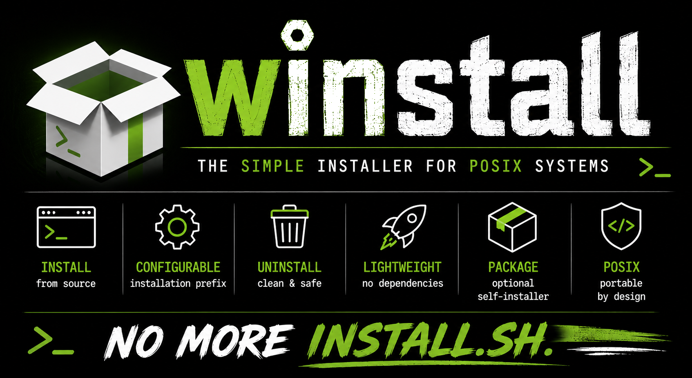

# WInstall - One installer for every project.

## 1.0 Files

|   Files/Dirs  |                     Description                           |
|---------------|-----------------------------------------------------------|
| images        | This folder contains picture used by the README.md files  |
| LICENSE       | GPL 3 license                                             |
| selfInstPckg  | The C code to build a self-installer software package     |
| winstall.sh   | The bash-installer script                                 |

## 2.0 Description

I have created **winstall** project because I was sick to write the usual INSTALL.sh for every project. So, I wrote this software
with the following features:

1) Reading configuration from easy-to-maintain local configuration files.
2) Software installation (file copying) in defined prefix path
3) Pre-install and post-install scripts management
4) Software removing
5) Self-installing package creation

This version (1.x.x) of Winstall is composed by two components: the main one is the **winstall.sh** BASH script (that manages all
the process); the second is the self-installer package generator. In order to use winstall in your source code, I suggest you to
store it (as submodule for example) inside your project, and execute winstall.sh script with the following syntax:

	<path>/winstall.sh --cmd={install|uninstall|build|clean|pkg} \
		[--verbose]                    \
		[--tmpFolder=<dir>]            \
		[--dataLogFolder=<dir>]        \
		[--prefix=<dir>]               \
		[--prjName=<string>]           \
		[--version={auto|<n>.<n>.<n>}]

### 2.1 How to write the main configuration file
As you can see in the previous section, you can drive the file installation (or the package creation) using the bash-script
arguments. But you can also use the winstall's configuration file (**winstall.conf**). Anyway, remember that the command-line
arguments overwrite the data originally defined in the configuration file. The configuration file must respect the following syntax:

	PRJNAME=<string>
	PREINST=<exec-file>
	POSTINST=<exec-file>
	PREFIX=<folder>
	DATALOGFOLDER=<folder>
	TMPFOLDER=<folder>
	VERSION={auto|<n>.<n>.<n>}
	DEPS_LIST={auto|<file.so>...}

- **PRJNAME**:       Name of the software. It is used for the filename used to remove the installed files and for the software
                     package filename
- **PREINST**:       Pre-installation step script. The script to execute before the file installation. If it fails then no files
                     will be installed
- **POSTINST**:      Post-installation step script. This script is executed after the file copying step. If it fails then
                     a warning message will be shown on the terminal
- **PREFIX**:        Installed files path prefix. Every installed file will be stored in a sub-folder of this defined prefix
                     (eg. for PREFIX=/usr/local, /bin/foo.bin --> /usr/local/bin/foo.bin)
- **DATALOGFOLDER**: This is the folder where the process will store all information to remove every software installed by
                     winstall
- **TMPFOLDER**:     A temporary folder used by the winstall process to store the collected files
- **VERSION**:       Project software version. If you set it to "auto" then the version will be calculated using GIT and the tags
                     you have created
- **DEPS_LIST**:     List of the dependence so-files to check or "auto" keyword to retrive the list automatically

### 2.2 How to write a sub-folder's configuration file
If you are installing your own software, or creating a software package, then the first step is collecting the files you want
install on the target system. In order to complete this task using the W-install tool, you have to create (one or more)
configurations file in every folder where the files are stored. Every winstall-configuration file must respect the following
syntax:

	FILES=<files>
	TGTPATH=<folder>
	CHMOD=<n><n><n>
	CHOWN=<user-name>
	[BUILDER=<exec-file|command>]
	[CLEANER=<exec-file|command>]
	[CHECK4DEPS=<binary filename>...]

Required fields:

- **FILES**:     The files to be installed. You can also use wildcards (eg. myProject*.exe)
- **TGTPATH**:   The folder where the defined files will be stored
- **CHMOD**:     The files permissions
- **CHOWN**:     The files owner

Optional fields:

- **BUILDER**:    The executable file or command to execute before collecting the files. Usually, it is used to make
                  binary files (eg. make all) or to use template files (eg. m4 file.template > file.dat)
- **CLEANER**:    The executable file or command that will clean the dynamically created files (eg. make cleanall) stored in
                  the folder
- **CHECK4DEPS**: Every binary file belonging to this list will be analyzed to find all used the shared-object file it uses.
                  Before the self-installing binary package installation phase, all those dependencies will be verified

Everyone of these config files manages the installation of a particular type of files (eg. binary, manpage, template...).
For this reason you can have more than one config-file in every folder, it depends by the files groups you want to handle.
More config files can exist in the same folder because their file-name must respect the following syntax:
**winstall_\<label\>.conf** (eg. winstall_bin.conf for binary files, winstall_doc.conf for manpages, ...)

### 2.3 How to install a software
After you have created all the winstall's configuration-files, you can proceed with your custom software installation, using
the following command:

	<path>/winstall.sh --cmd=install \
		[--verbose] [--prefix=<dir>] [--prjName=<string>] [--dataLogFolder=<dir>] 

The process will perform the following steps:

1) If a pre-install script (**PREINST**) has been defined, then it will be executed. If it fails the installation process
   will end.
2) The process will scan the current folder (and its sub-folders recursively) to find all the winstall_<label>.conf files.
   Using the information it will install every file in the right place with the defined attributes. The target folder of
   every file depends also by the **PREFIX** configured path. Using "--prefix=<dir>" argument you will overwrite it.
3) If a post-install script (**POSTINST**) has been defined, then it will be executed. If it fails the installation process
   will just print an error message
4) The process will store a file with the list of all installed files, in the folder defined by **DATALOGFOLDER** config-key.
   The name of this file will be equal to the (**PRJNAME**) defined project-name 

### 2.4 How to remove a software
Using winstall you can install and remove all software you need keeping the target system clean and safe. To achieve this result
you need to remove the software using the following syntax:

	<path>/winstall.sh --cmd=uninstall \
		[--verbose] [--dataLogFolder=<dir>] [--prjName=<string>]

The process will perform the following steps:

1) The process will look for the installed files log file (**PRJNAME**) in the proper folder (**DATALOGFOLDER**). If it does
   not exist then the process will end with the warning message "The software is not installed".
2) The log-file will be loaded, and the process will remove all the listed files.
3) The log-file will be removed

### 2.5 What is and how to create a self-installer package
This software tool provides you the possibility to get a self-installing binary package, too. Using this package you will be
able to install and remove the software in the target system without the request to have a package manager installed in that
system. It can be very useful in environments where you don't want to have a package manager already installed in your target
(like in some embedded software devices) or when you need to install the software in many different POSIX OSs or Linux 
distributions...

The following diagram shows you how the self-installer package is built internally:

	+----------------+
	| The installer  |
	|  binary code   |
	+----------------+
	|////////////////|
	|////////////////|
	|                |
	| TAR-GZ archive |
	|                |
	|////////////////|
	|////////////////|
	+----------------+

To create your own self-installer  binary package, use the following command:

	<path>/winstall.sh --cmd=pkg         \
		[--verbose]                    \
		[--tmpFolder=<dir>]            \
		[--dataLogFolder=<dir>]        \
		[--prefix=<dir>]               \
		[--prjName=<string>]           \
		[--version={auto|<n>.<n>.<n>}]

The process will perform the following steps:

1) In the temporary (**TMPFOLDER**), the process will collect all the files to be installed with the proper path (**PREFIX**).
   Also the pre-install script (**PREINST**) and post-install script (**POSTINST**) will be copied in the temporary folder.
   All these files are used to create a TGZ archive.
2) The installer C source-code will be compiled
3) The package will be created gluing the binary code with the TGZ archive to obtain a single self-installer package.

The executable bin package accepts the following arguments: --install, --uninstall, --help

#### 2.5.1 Advantages and disavdvantages
The following table shows you the main advantages and disadvantages of the self-installer binary packages vs package manager system solution.

|                     |                    Self-installing binary                      |                 DEB / RPM                 |
|---------------------|----------------------------------------------------------------|-------------------------------------------|
| **Portability**     | ✅ Independent from a specific package manager                 | ❌ Distribution/package-manager specific  |
| **Distribution**    | ✅ Single executable file                                      | ⚠️  Different packages may be required     |
| **Dependencies**    | ⚠️  Checked before installation, but not automatically resolved | ✅ Managed by the package manager         |
| **Uninstallation**  | ✅ Installed files are tracked and can be completely removed   | ✅ Managed by the package manager         |
| **PM integration**  | ✅ Independent of the system package manager                   | ❌ Requires the appropriate package-management infrastructure |
| **Virus infection** | ⚠️  As an executable file, it can potentially be infected; integrity can be verified before execution (MD5SUM)| ✅ Not directly executable, not executable-file infection |
| **Repos & updates** | ❌ No native repository/update infrastructure                  | ✅ Native support                         |

## 3.0 Tests
If you need to see a real-life using test, please consider the following projects of mine:

[virtualOscilloscope](https://github.com/catinella/virtualOscilloscope)

[minute](https://github.com/catinella/minute)

## 4.0 TODO
[TODO](TODO.md)

## 5.0 Changes
[CHANGES](Changes.md)

## 6.0 License
This project is free software, released under the terms of the **GNU Lesser General Public License, version 3 (LGPL-3.0)**.

You are free to use, modify, and redistribute this software in accordance with the terms of the license, including its use
as part of proprietary software, provided that the LGPL-licensed components and any modifications to them remain compliant
with the LGPL-3.0 requirements.

For the complete license terms, please refer to the [LICENSE-LGPL3.md](LICENSE-LGPL3.md) file included with this project.

Copyright © Silvano Catinella
